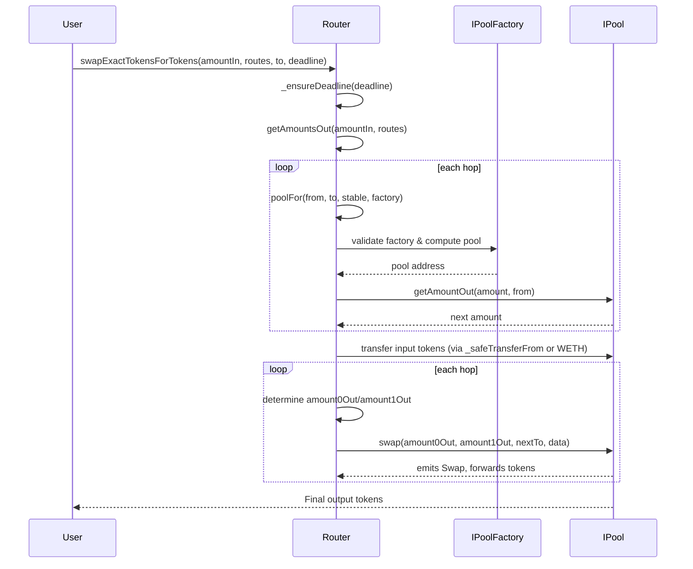
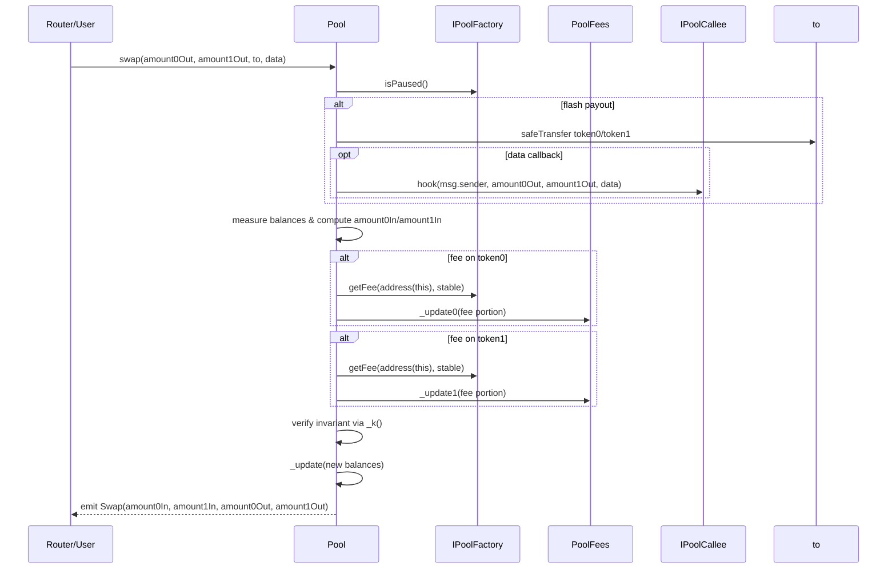
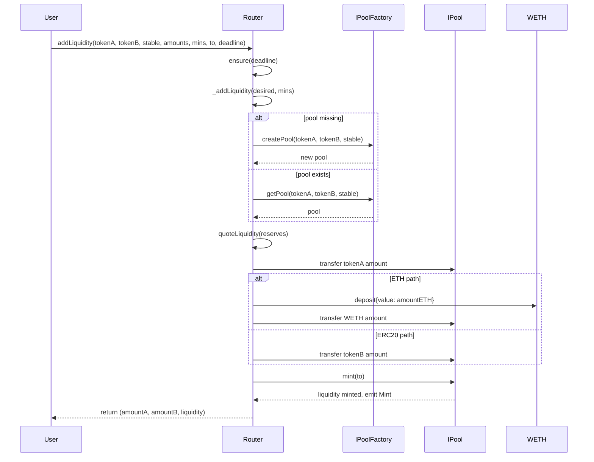
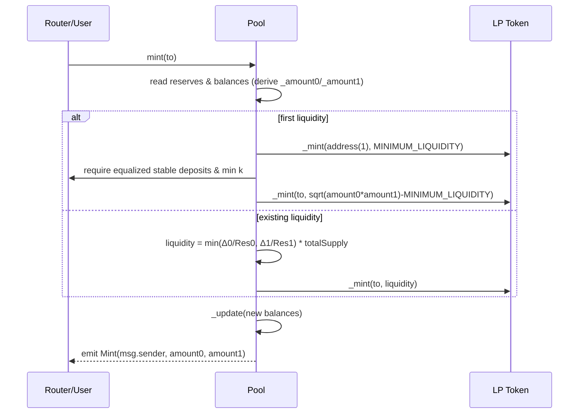
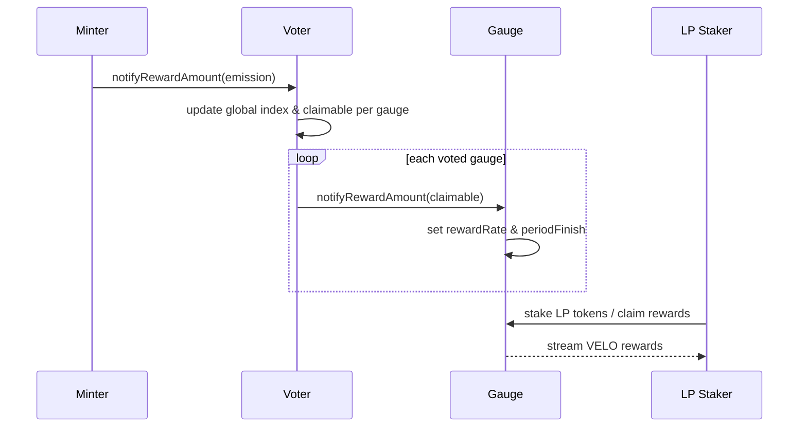
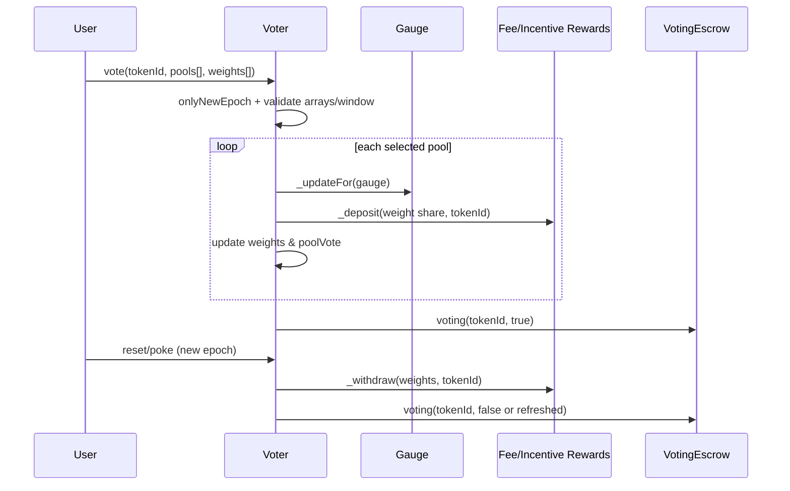

# Router Swap Flow

The `Router` orchestrates swaps across one or more pools by chaining pool lookups, token transfers, and pool-level `swap` calls.

1. A caller invokes a swap entrypoint such as `swapExactTokensForTokens`, which first checks the deadline via `ensure`/`_ensureDeadline` and derives per-hop outputs through `getAmountsOut` for the provided `routes` path.【F:contracts/Router.sol†L41-L44】【F:contracts/Router.sol†L303-L335】【F:contracts/Router.sol†L103-L116】
2. `getAmountsOut` iterates over each hop, using `poolFor` to resolve the concrete pool contract from the factory registry and then querying `IPool.getAmountOut` to compute the resulting amount for the next hop.【F:contracts/Router.sol†L66-L116】
3. After validating slippage, the Router transfers the caller’s input tokens (or wraps ETH) directly to the first pool via `_safeTransferFrom`/`weth.transfer` so the pool holds the input before the swap loop begins.【F:contracts/Router.sol†L319-L349】【F:contracts/Router.sol†L747-L752】
4. `_swap` walks the route list: for each hop it sorts the pair to determine the output token ordering, decides the `(amount0Out, amount1Out)` tuple from the precomputed amounts, picks the recipient (`to`) as either the next pool or the final address, and finally calls `IPool.swap` on the resolved pool.【F:contracts/Router.sol†L301-L315】
5. Each pool’s `swap` implementation (see `IPool` interface) pulls the input that was pre-positioned, updates reserves, and emits the swap event before handing tokens to the designated recipient.【F:contracts/interfaces/IPool.sol†L96-L150】
6. Fee-on-transfer supporting paths reuse the same routing structure but recompute `amountInput` per hop from pool balances before calling the same `IPool.swap` function.【F:contracts/Router.sol†L372-L451】

## Pool Swap Flow

`Pool.swap` settles a single hop for the Router by paying out requested tokens, collecting the caller’s input, skimming protocol fees, and synchronizing reserves for invariant enforcement.【F:contracts/Pool.sol†L344-L377】

1. The pool checks the factory-wide pause flag and ensures the requested output amounts do not exceed reserves before caching current balances.【F:contracts/Pool.sol†L345-L352】
2. It verifies the recipient is not either pool token, optimistically transfers `amount0Out`/`amount1Out`, optionally executes a `hook` callback for flash-loan style operations, and measures its post-transfer balances.【F:contracts/Pool.sol†L353-L361】
3. Incoming liquidity is inferred from the balance delta relative to the prior reserves; if both inputs are zero the transaction reverts.【F:contracts/Pool.sol†L362-L364】
4. For each non-zero input token the pool queries the factory for the current fee rate, siphons that portion to `PoolFees` via `_update0`/`_update1`, re-reads balances after the fee transfer, and ensures the constant-product (or stable-curve) invariant still holds.【F:contracts/Pool.sol†L367-L374】【F:contracts/Pool.sol†L153-L174】
5. Finally `_update` records the new reserves and cumulative pricing data before emitting the `Swap` event that the Router listens for.【F:contracts/Pool.sol†L211-L377】

# Router Add Liquidity Flow

`Router.addLiquidity` and its ETH variant coordinate pool deployment (if needed), optimal amount selection, token transfers, and LP minting via the target pool.【F:contracts/Router.sol†L203-L240】

1. The caller triggers `addLiquidity`/`addLiquidityETH`, which runs the shared `_addLiquidity` helper after validating the deadline through the `ensure` modifier.【F:contracts/Router.sol†L203-L240】【F:contracts/Router.sol†L36-L43】
2. `_addLiquidity` ensures desired inputs cover the minimums, lazily creates the pool through the factory when absent, and computes the optimal counterpart amount from existing reserves (or accepts the provided ratios when bootstrapping an empty pool).【F:contracts/Router.sol†L169-L200】
3. With final amounts known, the Router resolves the pool address via `poolFor` and pulls the computed token quantities from the caller (wrapping ETH into WETH when necessary) so the pool contract holds both legs.【F:contracts/Router.sol†L214-L238】
4. The Router invokes `IPool.mint` on the pool, which measures newly deposited balances, mints LP tokens proportionally (enforcing equalized stable deposits on first mint), locks the minimum liquidity, and updates reserves before emitting `Mint`.【F:contracts/Router.sol†L219-L238】【F:contracts/Pool.sol†L296-L318】

## Pool Add Liquidity Flow

`Pool.mint` finalizes a liquidity addition by measuring the just-deposited token deltas, minting LP tokens proportional to the contribution, synchronizing reserves, and emitting `Mint`.【F:contracts/Pool.sol†L295-L319】

1. The Router (or direct caller) transfers tokens into the pool, then calls `mint(to)`, which snapshots current reserves and on-chain token balances to compute `_amount0/_amount1` as the freshly deposited amounts.【F:contracts/Pool.sol†L295-L302】
2. On the first mint (`totalSupply == 0`) the pool locks `MINIMUM_LIQUIDITY` to `address(1)`, mints the remainder of `sqrt(amount0 * amount1) - MINIMUM_LIQUIDITY` to the depositor, and for stable pools enforces equalized normalized deposits plus a minimum invariant `k` threshold before allowing initialization.【F:contracts/Pool.sol†L303-L310】
3. Subsequent mints pro-rate liquidity by taking the lesser of the two ratios against existing reserves, guaranteeing the pool stays balanced even if the caller overfunded one side.【F:contracts/Pool.sol†L311-L313】
4. If the computed `liquidity` is below `MINIMUM_LIQUIDITY` the transaction reverts; otherwise the pool mints LP tokens to `to`, updates reserves via `_update`, and emits `Mint` with the actual deposited amounts so indexers can track liquidity additions.【F:contracts/Pool.sol†L314-L318】

## Voter Emission Flow

`Voter` ingests epoch VELO emissions from `Minter`, accrues each gauge’s share based on veNFT votes, and forwards the tokens to gauges so LP stakers can claim rewards over the epoch.【F:contracts/Voter.sol†L408-L512】

1. Once per epoch the `Minter` calls `Voter.notifyRewardAmount`, transferring the freshly minted VELO and bumping the global `index` so future distributions know how much emission corresponds to one unit of vote weight.【F:contracts/Voter.sol†L125-L162】【F:contracts/Voter.sol†L408-L417】
2. `_updateFor` runs (either lazily or during explicit `updateFor`/`distribute`) to compare each gauge’s previous `supplyIndex` against the new global `index`, crediting `claimable[gauge]` proportionally to the pool’s vote weight.【F:contracts/Voter.sol†L439-L457】
3. `distribute` (batch or targeted) first nudges the `Minter` via `updatePeriod` to ensure the epoch’s emission is ready, then calls `_distribute` for each gauge, which zeroes `claimable`, approves the gauge, and invokes `IGauge.notifyRewardAmount` with the owed VELO.【F:contracts/Voter.sol†L486-L512】
4. Gauges transfer the VELO in, compute a per-second reward rate for the rest of the epoch, and expose `earned`/`getReward` so LP depositors streaming their pool tokens through the gauge can withdraw VELO emissions pro-rata to their staked balance.【F:contracts/gauges/Gauge.sol†L195-L238】

## User Vote Flow

`Voter.vote` lets a veNFT holder apportion their voting power across gauges each epoch so emissions flow toward preferred pools.【F:contracts/Voter.sol†L255-L272】

1. During the vote window (after `epochVoteStart` and before the whitelisted-only tail via `epochVoteEnd`), the caller must be the veNFT owner or approved operator, provide matching pool/weight arrays under `maxVotingNum`, and satisfy `onlyNewEpoch`, preventing multiple votes per epoch.【F:contracts/Voter.sol†L102-L272】
2. Voter reads the veNFT balance as total weight, then `_vote` normalizes the requested weights, reverting if any target lacks a live gauge or if the computed pool share rounds to zero.【F:contracts/Voter.sol†L215-L236】
3. For every pool, `_vote` syncs gauge accounting via `_updateFor`, records the pool in `poolVote`, bumps `weights`/`votes`, deposits the veNFT’s share into the gauge fee/incentive trackers, and accumulates `usedWeight`/`totalWeight` before emitting `Voted`.【F:contracts/Voter.sol†L236-L252】
4. When at least one pool receives weight, Voter flags the veNFT as “voting” inside `VotingEscrow`, blocking withdrawals until the user later resets; `usedWeights[_tokenId]` persists the allocation for pokes or incentives accounting.【F:contracts/Voter.sol†L249-L252】【F:contracts/VotingEscrow.sol†L1067-L1081】
5. To change targets, the user can call `reset` (once the epoch rolls) which unwinds weights, withdraws from reward trackers, and clears `poolVote`, or call `poke` to reapply the existing pool list using the veNFT’s refreshed balance.【F:contracts/Voter.sol†L165-L214】

