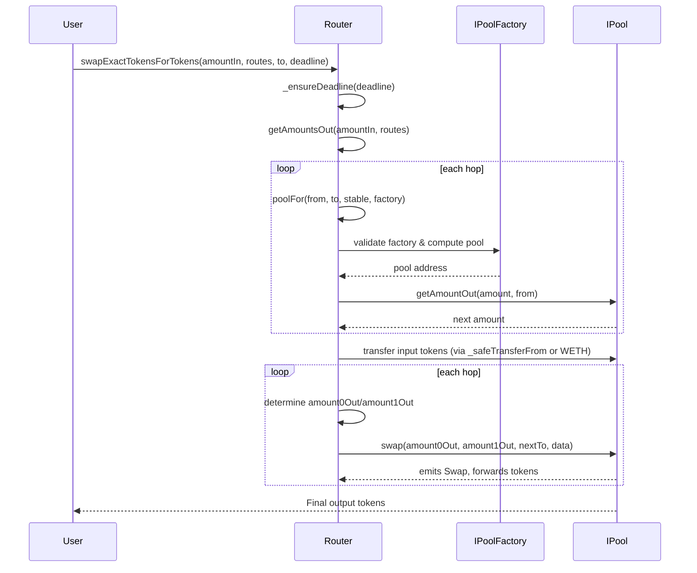

# Router Swap Flow

The `Router` orchestrates swaps across one or more pools by chaining pool lookups, token transfers, and pool-level `swap` calls.

1. A caller invokes a swap entrypoint such as `swapExactTokensForTokens`, which first checks the deadline via `ensure`/`_ensureDeadline` and derives per-hop outputs through `getAmountsOut` for the provided `routes` path.【F:contracts/Router.sol†L41-L44】【F:contracts/Router.sol†L303-L335】【F:contracts/Router.sol†L103-L116】
2. `getAmountsOut` iterates over each hop, using `poolFor` to resolve the concrete pool contract from the factory registry and then querying `IPool.getAmountOut` to compute the resulting amount for the next hop.【F:contracts/Router.sol†L66-L116】
3. After validating slippage, the Router transfers the caller’s input tokens (or wraps ETH) directly to the first pool via `_safeTransferFrom`/`weth.transfer` so the pool holds the input before the swap loop begins.【F:contracts/Router.sol†L319-L349】【F:contracts/Router.sol†L747-L752】
4. `_swap` walks the route list: for each hop it sorts the pair to determine the output token ordering, decides the `(amount0Out, amount1Out)` tuple from the precomputed amounts, picks the recipient (`to`) as either the next pool or the final address, and finally calls `IPool.swap` on the resolved pool.【F:contracts/Router.sol†L301-L315】
5. Each pool’s `swap` implementation (see `IPool` interface) pulls the input that was pre-positioned, updates reserves, and emits the swap event before handing tokens to the designated recipient.【F:contracts/interfaces/IPool.sol†L96-L150】
6. Fee-on-transfer supporting paths reuse the same routing structure but recompute `amountInput` per hop from pool balances before calling the same `IPool.swap` function.【F:contracts/Router.sol†L372-L451】

