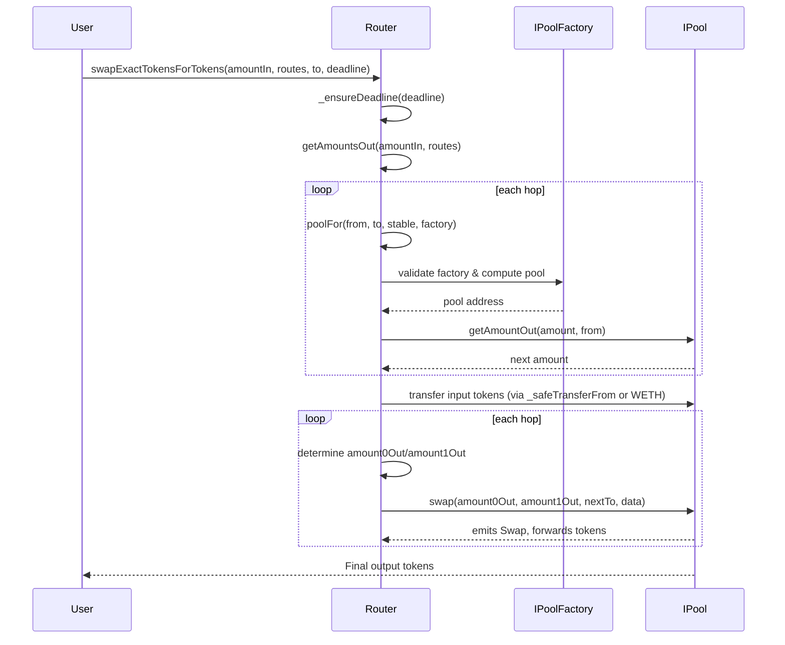
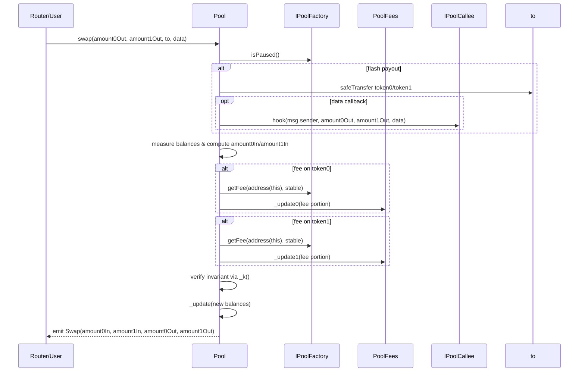
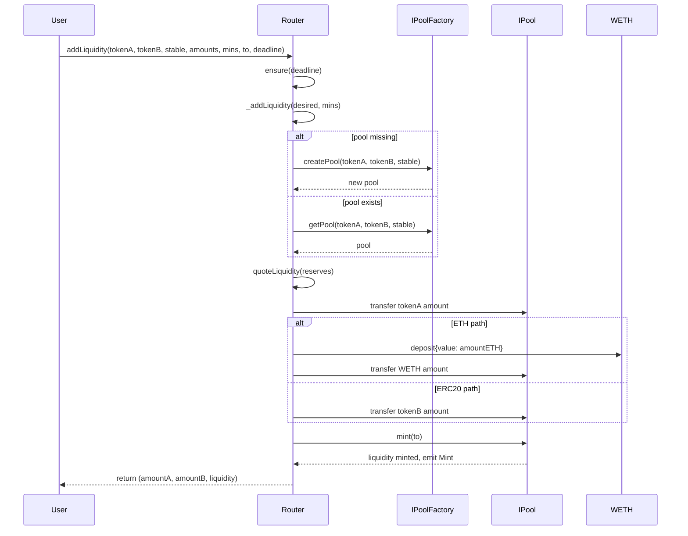

# Router Swap Flow

The `Router` orchestrates swaps across one or more pools by chaining pool lookups, token transfers, and pool-level `swap` calls.

1. A caller invokes a swap entrypoint such as `swapExactTokensForTokens`, which first checks the deadline via `ensure`/`_ensureDeadline` and derives per-hop outputs through `getAmountsOut` for the provided `routes` path.【F:contracts/Router.sol†L41-L44】【F:contracts/Router.sol†L303-L335】【F:contracts/Router.sol†L103-L116】
2. `getAmountsOut` iterates over each hop, using `poolFor` to resolve the concrete pool contract from the factory registry and then querying `IPool.getAmountOut` to compute the resulting amount for the next hop.【F:contracts/Router.sol†L66-L116】
3. After validating slippage, the Router transfers the caller’s input tokens (or wraps ETH) directly to the first pool via `_safeTransferFrom`/`weth.transfer` so the pool holds the input before the swap loop begins.【F:contracts/Router.sol†L319-L349】【F:contracts/Router.sol†L747-L752】
4. `_swap` walks the route list: for each hop it sorts the pair to determine the output token ordering, decides the `(amount0Out, amount1Out)` tuple from the precomputed amounts, picks the recipient (`to`) as either the next pool or the final address, and finally calls `IPool.swap` on the resolved pool.【F:contracts/Router.sol†L301-L315】
5. Each pool’s `swap` implementation (see `IPool` interface) pulls the input that was pre-positioned, updates reserves, and emits the swap event before handing tokens to the designated recipient.【F:contracts/interfaces/IPool.sol†L96-L150】
6. Fee-on-transfer supporting paths reuse the same routing structure but recompute `amountInput` per hop from pool balances before calling the same `IPool.swap` function.【F:contracts/Router.sol†L372-L451】

## Pool Swap Flow

`Pool.swap` settles a single hop for the Router by paying out requested tokens, collecting the caller’s input, skimming protocol fees, and synchronizing reserves for invariant enforcement.【F:contracts/Pool.sol†L344-L377】

1. The pool checks the factory-wide pause flag and ensures the requested output amounts do not exceed reserves before caching current balances.【F:contracts/Pool.sol†L345-L352】
2. It verifies the recipient is not either pool token, optimistically transfers `amount0Out`/`amount1Out`, optionally executes a `hook` callback for flash-loan style operations, and measures its post-transfer balances.【F:contracts/Pool.sol†L353-L361】
3. Incoming liquidity is inferred from the balance delta relative to the prior reserves; if both inputs are zero the transaction reverts.【F:contracts/Pool.sol†L362-L364】
4. For each non-zero input token the pool queries the factory for the current fee rate, siphons that portion to `PoolFees` via `_update0`/`_update1`, re-reads balances after the fee transfer, and ensures the constant-product (or stable-curve) invariant still holds.【F:contracts/Pool.sol†L367-L374】【F:contracts/Pool.sol†L153-L174】
5. Finally `_update` records the new reserves and cumulative pricing data before emitting the `Swap` event that the Router listens for.【F:contracts/Pool.sol†L211-L377】

## Add Liquidity Flow

`Router.addLiquidity` and its ETH variant coordinate pool deployment (if needed), optimal amount selection, token transfers, and LP minting via the target pool.【F:contracts/Router.sol†L203-L240】

1. The caller triggers `addLiquidity`/`addLiquidityETH`, which runs the shared `_addLiquidity` helper after validating the deadline through the `ensure` modifier.【F:contracts/Router.sol†L203-L240】【F:contracts/Router.sol†L36-L43】
2. `_addLiquidity` ensures desired inputs cover the minimums, lazily creates the pool through the factory when absent, and computes the optimal counterpart amount from existing reserves (or accepts the provided ratios when bootstrapping an empty pool).【F:contracts/Router.sol†L169-L200】
3. With final amounts known, the Router resolves the pool address via `poolFor` and pulls the computed token quantities from the caller (wrapping ETH into WETH when necessary) so the pool contract holds both legs.【F:contracts/Router.sol†L214-L238】
4. The Router invokes `IPool.mint` on the pool, which measures newly deposited balances, mints LP tokens proportionally (enforcing equalized stable deposits on first mint), locks the minimum liquidity, and updates reserves before emitting `Mint`.【F:contracts/Router.sol†L219-L238】【F:contracts/Pool.sol†L296-L318】

